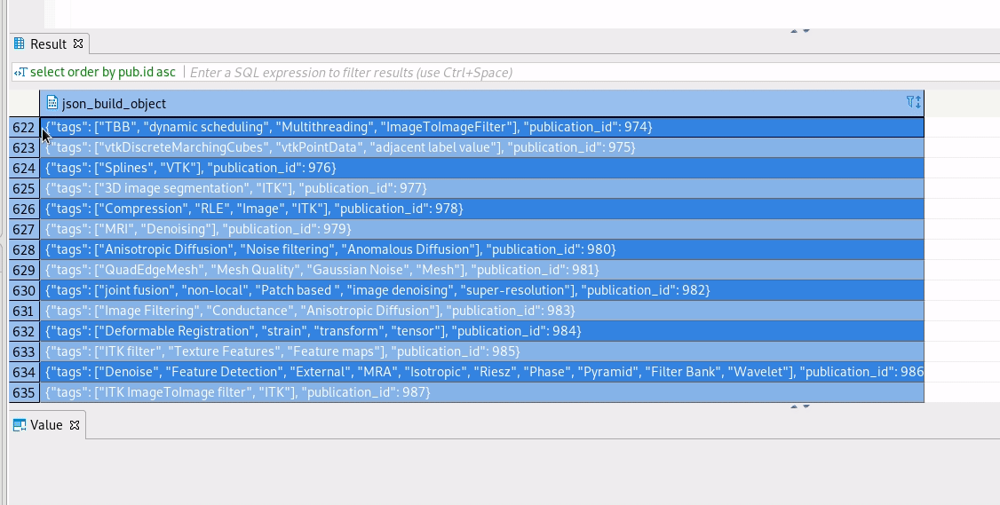

InsightJournal-dev
------------------

This repository deals with cleaning and extracting data from the existing database (postgresql)
to json objects per publication. (Also a list of author/reviewers/active persons can be queried)

For postgresql development I was using dbeaver (eclipse based)
The only thing I was doing that uses IDE function is the export/copy data.
The queries generate as an output a jsonb object, Use the Shift-Ctrl-C (advanced copy)
to add a comma `,` to separate the different rows. See gif:



Extracting bitstreams
---------------------

[python-extract-bitstreams.py](./python-scripts/python-extract-bitstreams.py) is used to download
all the bitstreams/blobs associated with a publication from the current Insight-Journal site. Each publication can have different revisions.
Any shared data between revisions is duplicated in each folder in order to get revisions as independent/publishable states
(think of them as releases).
The bitstreams are uploaded to a girder instance in [data.kitware](https://data.kitware.com/#collection/5cb75e388d777f072b41e8db)
```bash
girder-client --api-url https://data.kitware.com/api/v1 --api-key xxxxxxxxxxxxxxxxx upload 5cc782658d777f072b7834a2 ./bitstreams_folder
```
The bitstreams are not stored in the database, so be sure to duplicate the data regularly.

[python-extract-logo.py](./python-scripts/python-extract-logo.py) is used to extract logos/data blobs from the database directly. They are still
stored there (and also externally).

[remove_duplicateName.py](./python-scripts/remove_duplicatedName.py):
In the quest to create revisions that make copies of data, different files with the name happen. We append the string `_duplicateNameX` to the name.
And then check if those files are actually the same (in that case we only keep one file) or they are indeed different files, in that case we keep them.
Some results of this scripts can be seen in [removed_duplicated_names_stats.txt](./python-scripts/removed_duplicated_names_stats.txt)

Creating metadata.json per publication
--------------------------------------

Different sql queries are stored in the folder [sql-scripts](./sql-scripts/).
The original approach was to use [create_json_per_publication_from_sql.py](./python-scripts/create_json_per_publication_from_sql.py).
But some sql queries require post-processing in form of a `sed` (I was using vim) substitution.
So the recommended approach is to first generate and export the json data per query to a file (check dbeaver way to export data in this document). This json files per query are stored in [cleaned_json_data](./cleaned_json_data) (with the post-process substitution in place)

Then the final goal of generating a `metadata.json` per publication is done in [merge_json_data_by_publication_id.py](python-scripts/merge_json_data_by_publication_id.py).


Check [readme.sql](./readme.sql) for all the steps pursued to clean the database. They can be executed all at once (and in a reproducible manner) from [clean_database.sql](./sql-scripts/clean_database.sql), starting from a dumped postgresql database of the live site.
